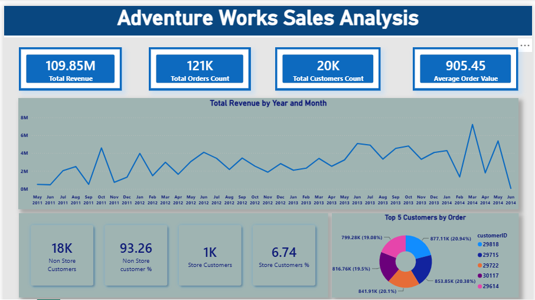

# AdventureWorks Sales Analysis — Data Analytics Project

An end-to-end sales analysis of the AdventureWorks 2019 dataset, built across two layers — **SQL and Power BI** — exploring product performance, customer behavior, sales operations, and territory revenue for a global bicycle and cycling-accessories manufacturer.

---

## 📊 Project Overview

This project investigates what drives AdventureWorks' sales performance — from product category revenue and pricing/discount patterns, to customer purchasing behavior, delivery timing, and territory-level performance — using the official Microsoft AdventureWorks2019 sample database.

The project was planned and built as a deliberate 2-layer pipeline:

| **Pipeline Layer** | **Primary Tool** | **Core Implementation & Scope** |
| :--- | :--- | :--- |
| **Layer 1** | SQL (T-SQL) | Schema/relationship exploration, exploratory data analysis across 9 tables, reusable views for BI consumption |
| **Layer 2** | Power BI | Custom date dimension (DAX), KPI cards, time-intelligence trend analysis, and an interactive sales overview dashboard |

Rather than importing the whole database blindly, the SQL layer started by mapping out primary/foreign key relationships and profiling each table (row counts, distinct keys, join integrity) before writing a single business-question query — the same disciplined approach used across the SQL portfolio.

---

## 🗂️ Repository Structure

```
adventureworks2019-sales-analysis/
├── README.md
├── sql/                      # Full SQL script (schema exploration + EDA)
├── power_bi/                 # Interactive Power BI report (.pbix)
├── schema_diagram/           # Table relationship / ER diagram
└── report/                   # Final dashboard preview (PNG)
```

---

## 📁 Dataset

Sourced from Microsoft's official **AdventureWorks2019** sample database (restored from a `.bak` file), covering the full pre-built schema. This project focuses on 9 sales-relevant tables: `ProductCategory`, `ProductSubcategory`, `Product`, `SalesOrderDetail`, `SalesOrderHeader`, `SalesTerritory`, `Customer`, `SalesPerson`, and `Address`.

---

## 1️⃣ Layer 1 — SQL

**File:** [`sql/AdventureWorks2019_Sales_Analysis.sql`](./sql)

### Schema & Relationship Exploration
Before any analysis, all primary/foreign key relationships were mapped programmatically:
```sql
SELECT
    fk.name AS ForeignKey,
    OBJECT_NAME(fk.parent_object_id) AS ChildTable,
    COL_NAME(fkc.parent_object_id, fkc.parent_column_id) AS ChildColumn,
    OBJECT_NAME(fk.referenced_object_id) AS ParentTable,
    COL_NAME(fkc.referenced_object_id, fkc.referenced_column_id) AS ParentColumn
FROM sys.foreign_keys fk
JOIN sys.foreign_key_columns fkc
    ON fk.object_id = fkc.constraint_object_id
```
Each table was then profiled independently (row counts, distinct key counts, join coverage) to catch gaps before they surfaced as silent bugs downstream — e.g. confirming only 266 of 504 products have ever appeared in a sale.

### Data Quality Checks
- Orders shipped on/after their `DueDate` (delivery breach check) — none found
- Products where `ModifiedDate` falls outside the `SellStartDate`/`SellEndDate` window — 98 products flagged, with a follow-up query confirming 21,848 related order-detail records for further investigation

### Exploratory Data Analysis
40+ business questions answered across product, pricing, customer, territory, and salesperson dimensions, using CTEs, window functions, and conditional aggregation. A sample — tracking how often a product's selling price has diverged from its current list price:
```sql
;With price_change as(
Select prod.ProductID, prod.Name, prod.ListPrice as Listed,
ord.UnitPrice as Selling_Price,
Cast((ord.UnitPrice-prod.ListPrice)as decimal(12,2)) as Price_Diff
from Production.Product prod inner join sales.SalesOrderDetail ord
on prod.ProductID = ord.ProductID
where prod.ListPrice <> ord.UnitPrice)

Select ProductID, count(productid) as count_of_Product
from price_change
group by ProductID
order by count_of_Product desc
```
This surfaced that ~94% of sold products (250 of 266) have had their price diverge from the current list price at least once — one product as many as 1,192 times.

### Reusable Views (built for Power BI consumption)
| View | Purpose |
|---|---|
| `vw_customer_store_linkage` | Store-linked vs. individual customer counts and percentages |
| `vw_customers_orders_revenue` | Per-customer order count and total order value |
| `vw_store_customer_count` | Customer count per store |
| `vw_territories_yearly_orders_revenues` | Territory-level revenue and order count, by year |
| `vw_customer_distribution_cities` | Customer count by city |

---

## 2️⃣ Layer 2 — Power BI

**File:** [`power_bi/AdventureWorks_2019_Sales_Analysis.pbix`](./power_bi)

### Data Modeling
- Built a custom **Date dimension table** via `CALENDARAUTO()` (rather than Power BI's default hidden auto date/time), marked as the official Date Table, with `Year`, `MonthNumber`, `MonthName`, and a `YearMonth`/`YearMonthSort` pair for correct chronological axis ordering on time-series visuals
- Related `DimDate` to the sales fact data on order date

### Dashboard — Sales & Customer Overview
- **KPI cards**: Total Revenue (109.85M), Total Orders (121K), Total Customers (20K), Average Order Value (905.45)
- **Revenue trend line** by Year/Month, built on the custom date dimension
- **Top 5 Customers by Order Value** — donut chart, sourced from `vw_customers_orders_revenue`
- **Store-linked vs. non-store customer summary** — from `vw_customer_store_linkage`

### Sample Report Page

*Sales & Customer Overview — the project's single-page interactive dashboard.*

---

## 💡 Key Insights

- **Pricing is far from static**: ~94% of sold products have had their selling price diverge from the current list price at least once, with some products repriced over 1,000 times across their sales history — list price alone is not a reliable stand-in for actual realized revenue
- **Product reach is concentrated**: only 266 of 504 products (~53%) have ever been sold, meaning nearly half the catalog carries zero sales history
- **Delivery reliability is strong**: zero orders in the dataset shipped on or after their due date
- **Customer base skews non-store**: the majority of AdventureWorks customers are individual (non-store-linked) buyers rather than store accounts
- **Revenue is not evenly spread**: a small set of top customers accounts for a disproportionate share of total order value

---

## 🔍 How to Explore This Project

- **Interactive report**: open [`power_bi/AdventureWorks_2019_Sales_Analysis.pbix`](./power_bi) in Power BI Desktop
- **Reproduce the analysis**: run [`sql/AdventureWorks2019_Sales_Analysis.sql`](./sql) against a restored AdventureWorks2019 database
- **Schema reference**: see [`schema_diagram/`](./schema_diagram) for the table relationship diagram
